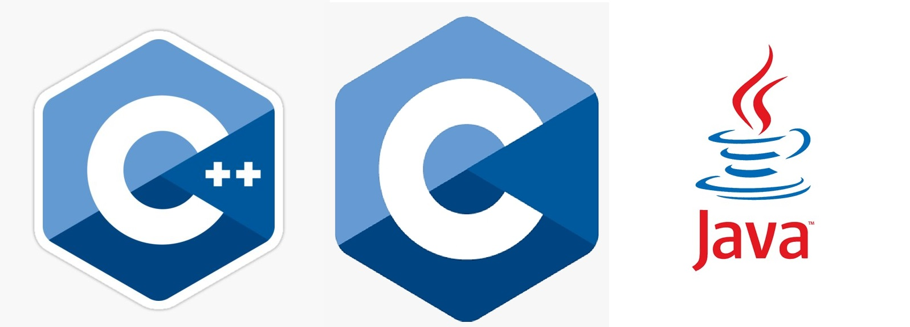

- 👋 Hi, I’m @HKDngIT (Khiem)
- 👀 After years of theory in school, study and simple coding I want to finally put my know-how into use in the IT industry!
- ✨ I have basic knowledge in Java, C and C++...
- 😊 ... and in electrical science as well - I'm still a student at "Technische Hochschule Ulm"
- 🌱 I’m currently learning C#
- 😄 Pronouns: He/ Him
- ⭐ Main goal is to grow my knowledge and add more and more projects to my repositories
  
# Tasks and projects in planning
  - [ ] Rewrite most of my current source code of tasks from C++ to C#(if possible)
  - [ ] Analysis program for my aquarium water parameters (in C++ or Java I dont know yet)
  - [ ] Implement the same program into an android-application
  - [ ] Making a simple kanban program
  - [ ] Using GITHUB PAGE to publish that site
  - [ ] Using old laptop as a local file server for personal use
  - [ ] Programs for basic eletrical science problems
 
# Currently working on
- [ ] A simple HTML site(hosted in github) which represents myself. The link to it is <a href="https://hkdngit.github.io/OwnWebsite/" target="_blank">here</a>

# Done tasks or projects
- [x] Switching OS on old Laptop from Windows 8 into Linux for future use(I used Pop!OS)
 

<!---
HKDngIT/HKDngIT is a ✨ special ✨ repository because its `README.md` (this file) appears on your GitHub profile.
You can click the Preview link to take a look at your changes.
--->
